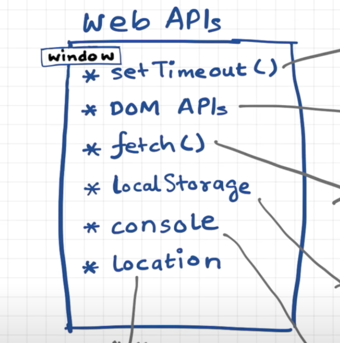
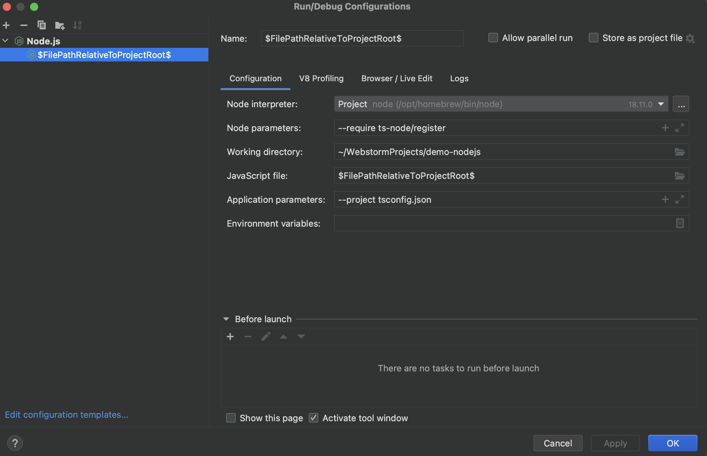
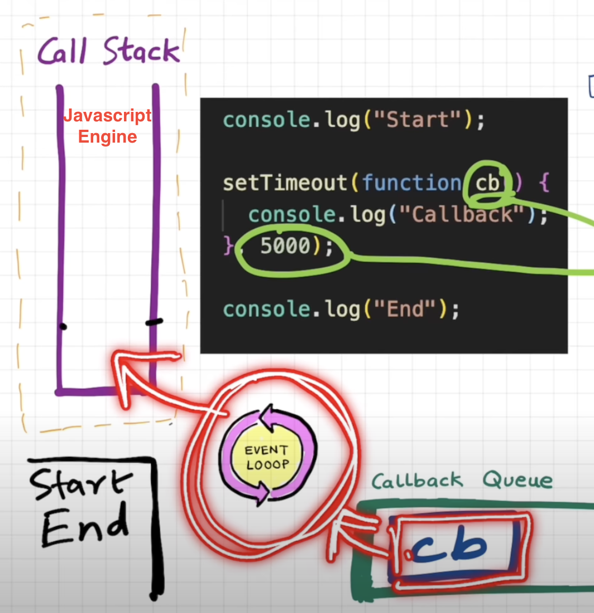
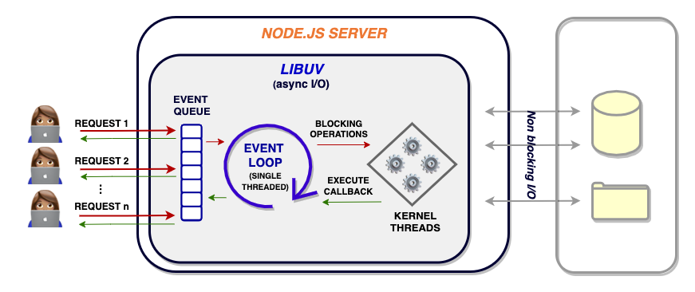
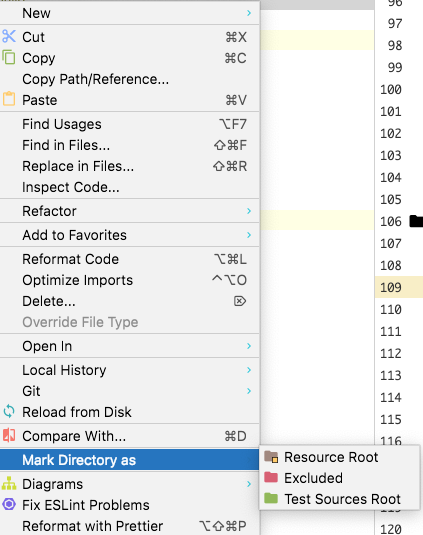

Node.js is essentially a Javascript runtime built on top of Chrome’s V8 Javascript engine. 

Single-Threaded Event Loop Architecture in Node.js

https://www.youtube.com/watch?v=xckH5s3UuX4

***********************
Following are not part of Javascript, but browser web api

https://www.youtube.com/watch?v=8zKuNo4ay8E
***********************
More details on Nodejs

https://scoutapm.com/blog/nodejs-architecture-and-12-best-practices-for-nodejs-development

~ % brew install node

 ~ % tsc -v
Version 4.8.4

 ~ % npm -v                        
8.19.2

`npm will be installed along nodejs`

1. Create a node-js project from Webstorm
2. npm --init => Creates package.json and package-lock.json
3. Install typescript  `npm install typescript --save-dev` => Creates tsconfig.json
4. Install ts-node `npm install ts-node --save-dev`

***********************
**Run Configuration - Webstorm**

https://www.jetbrains.com/help/webstorm/running-and-debugging-typescript.html#ws_ts_run_debug_server_side


***********************

**Event Loop**

Event loop polls and checks for any items in callback queue and move them to call stack for execution.

It constantly keeps track of the status of your asynchronous tasks (eg. the code in your callback functions) and moves them back to the execution queue when they’re completed. It operates in the same main thread.



**Worker Pool** - Auxiliary synchronous threads in the system kernel that Node.js can utilize for extensive disk and network-based async operations





********************
**ESLint Config**
npm init @eslint/config

(OR)

**Install ESLint Manually**

`npm install eslint @typescript-eslint/parser @typescript-eslint/eslint-plugin --save-dev`

* eslint: ESLint core library
* @typescript-eslint/parser: parser that allows ESLint to understand TypeScript code
* @typescript-eslint/eslint-plugin: plugin with a set of recommended TypeScript rules


*******************

**Install Prettier**

`npm install eslint @typescript-eslint/parser @typescript-eslint/eslint-plugin --save-dev`

-----

**Specify Node Versions with package n**

npm install -g n

### Install node specific version with 'n'
```shell
sudo n 14
```

### List down all the available node vesions installed on machine
```shell
> n ls
node/14.21.2
node/19.3.0
```

### Switch to specific version
```shell
> n
  ο node/14.21.2
  ο node/19.3.0

#### Use up/down arrow keys to select a version, return key to install, d to delete, q to quit
```

https://www.npmjs.com/package/n

**Specify Node Versions with .nvmrc (Node Version Manager)**

Install Node Version Manager :
https://github.com/nvm-sh/nvm


`node -v > .nvmrc` => Is specifying that Node.js <VERSION> should be used

`nvm use` => To download, install, and switch to that version

`nvm install` => Call would then install dependencies in line with that version.


## What is rc file stand for?
 
 rc - run commands
 
 * .[program or binary name]rc
 * .eslintrc
 * .zshrc
 * .nvmrc
 
## Jetbrains avoid finding JS extension files while working with Typescript files
 
 Right click on build directory where js extension files exist and mark it as excluded
 
 
